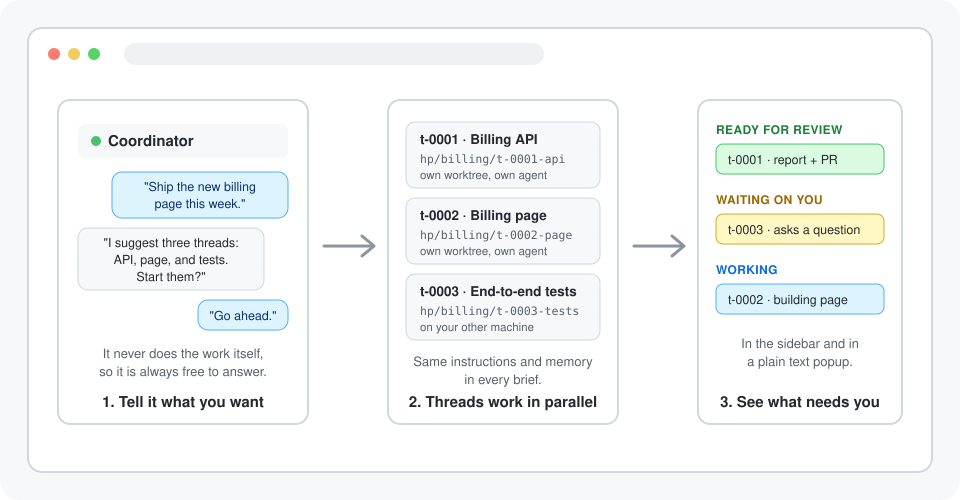

<p align="center"></p>

<h3 align="center">Run a whole project across your coding agents without handing each one its task or keeping track of who is doing what</h3>

<p align="center">Herdr Projects lets you run a larger piece of work in <a href="https://herdr.dev">Herdr</a> when one agent isn't enough and managing five by hand is a job in itself. You talk to one coordinator agent. It starts a separate agent for each task on its own branch, gives every one of them the same goal, instructions and memory, and Herdr's own sidebar shows you which threads need you, which are ready for review and which are still working.</p>

<p align="center"></p>

<p align="center"><a href="https://github.com/eliasstravik/herdr-projects/blob/main/docs/getting-started.md"></a></p>

<p align="center"><sub>✓&nbsp;Free,&nbsp;MIT&nbsp;licensed &nbsp; ✓&nbsp;Runs&nbsp;on&nbsp;your&nbsp;machines,&nbsp;no&nbsp;hosted&nbsp;service &nbsp; ✓&nbsp;macOS&nbsp;and&nbsp;Linux,&nbsp;Herdr&nbsp;0.9.1+</sub></p>

<br />

## Keep one conversation going while the work happens in parallel

The coordinator never does the work itself, so it's always free to answer you. Each task runs in its own thread: a separate agent in its own git worktree and branch, or in its own folder when there's no repository. You read reports and answer the threads that need you instead of briefing every agent yourself.

## Choose between briefing each agent by hand, one long agent session, a cloud projects product, or a coordinator in Herdr

| | **Herdr Projects** | Briefing agents by hand | One long agent session | Cloud projects products |
|---|:---:|:---:|:---:|:---:|
| **No extra software fee** | ✅ | ✅ | ✅ | ❌ |
| **Parallel tasks on separate branches** | ✅ | ✅ | ❌ | ✅ |
| **Same instructions and memory for every task** | ✅ | ❌ | ✅ | ✅ |
| **One conversation that stays free to answer** | ✅ | ❌ | ❌ | ✅ |
| **Threads grouped by what needs you** | ✅ | ❌ | ❌ | ✅ |
| **Runs on your own machines** | ✅ | ✅ | ✅ | ❌ |
| **Adopts an agent pane you already started** | ✅ | ✅ | ❌ | ❌ |
| **Works with the agent CLI you already use** | ✅ | ✅ | ✅ | ❌ |
| **Runs with no machine of yours switched on** | ❌ | ❌ | ❌ | ✅ |

Keep your attention on decisions. Herdr Projects starts and tracks the threads, your agents do the work, and you choose what to review, answer, or merge.

## Tell the coordinator what you want. See which thread needs you in the sidebar.

### 📈 See every thread at a glance

Each thread's sidebar row shows its id and title, a state line (`needs you · ~55%` in red, `review · PR #4` in yellow, `working · ~40%`) and the agent's own activity. Each project's row says `2 need you · 3 working`, the tab bar says `projects: 2 need you`, and the agent list is sorted with what needs you first. `prefix+a` opens one popup with threads, tasks, inbox, routines and settings, where every thread's own list of next steps is a number key away.

### ⚡ Stop briefing every agent yourself

Say what you want once. The coordinator proposes threads and waits for your go-ahead, then each thread starts from a brief with the project's goal, your standing instructions, the project's memory and its task, on the agent you pick (Claude Code, Codex, OpenCode or any other kind Herdr runs). Lessons a thread reports under `## Remember` flow back into memory for the next one.

### 💬 Know when a thread needs an answer

Agents report their own progress, so a thread that asked you something shows `needs you` even when it looks idle, and you get a notification that names the project and the thread. A background ticker follows pull requests: failing checks and review comments go back to the thread to fix, and a merged pull request resolves the thread and removes its worktree and branch.

## Open your first project in three steps

<table>
<tr>
<td align="center" valign="top" width="33%"><h3>1️⃣</h3><b>Install and configure</b><br /><sub>Run <code>herdr plugin install eliasstravik/herdr-projects</code>, then <code>herdr-projects configure</code> once for the sidebar rows, the popup key and the progress hooks.</sub></td>
<td align="center" valign="top" width="33%"><h3>2️⃣</h3><b>Create and open a project</b><br /><sub>Run the <b>Projects: new project</b> action, or <code>herdr-projects new "Billing" --repo ~/dev/app</code> then <code>herdr-projects open billing</code>. A coordinator agent starts in the project's folder and primes itself from its <code>AGENTS.md</code>.</sub></td>
<td align="center" valign="top" width="33%"><h3>3️⃣</h3><b>Tell it what you want</b><br /><sub>Describe the work in the coordinator's pane. It suggests threads, you say go ahead, and the sidebar shows each thread's state as it works.</sub></td>
</tr>
</table>

## Get everything included, free

<table align="center">
<tr>
<td align="center" valign="top"><sub>For developers who run coding agents in Herdr on macOS or Linux</sub><br /><h2>Free</h2><div align="left">&nbsp;&nbsp;&nbsp;✓&nbsp; A coordinator that delegates and never does the work itself<br />&nbsp;&nbsp;&nbsp;✓&nbsp; Threads on their own worktree and branch, or in a tab<br />&nbsp;&nbsp;&nbsp;✓&nbsp; Shared instructions and memory in every brief<br />&nbsp;&nbsp;&nbsp;✓&nbsp; What needs you, in the sidebar, the tab bar and one popup<br />&nbsp;&nbsp;&nbsp;✓&nbsp; Pull request follow-up, routines, cleanup after a merge<br />&nbsp;&nbsp;&nbsp;✓&nbsp; Threads on your saved SSH machines, reports copied home</div></td>
</tr>
<tr>
<td align="center"><a href="https://github.com/eliasstravik/herdr-projects/blob/main/docs/getting-started.md"></a></td>
</tr>
</table>

## Get your questions answered

### Do I need to know how to code?

You need to be comfortable in a terminal. The plugin builds itself on install, and a project is a plain folder of Markdown and TOML files, but you never have to edit them: everything changes by asking the coordinator or from the popup. You'll need macOS or Linux, Herdr 0.9.1 or newer, Rust/Cargo, Git, and an agent CLI Herdr can start, such as Claude Code. The [getting-started guide](docs/getting-started.md) covers the prerequisites.

### How do I check that Herdr Projects is running?

Run:

```bash
herdr plugin action invoke doctor --plugin herdr-projects
```

The command checks the Herdr version, the tools it calls, the ticker, and each project's session. The [getting-started guide](docs/getting-started.md#check-your-setup) walks through a project that won't open, a thread that doesn't start, and a ticker that isn't running.

### What permissions does the coordinator need?

It runs the `herdr-projects` binary every turn, so you'll want to allow-list it in your agent **by subcommand, never the bare binary**. Allow reading and steering (`skill`, `context`, `report`, `inbox done`, `thread list`, `thread prompt`, `thread next` and the like) and leave `thread resolve`, `sweep`, `delete`, `routine approve` and `configure` on your agent's normal permission prompt. Leave `thread start` off the list too unless you've set `start_threads = "auto"`: then every thread start is a real confirmation. [Operations](docs/operations.md#the-allow-list-for-your-coordinator) has the exact patterns.

### Does the plugin send my project to a hosted service?

No. A project is a folder on your machine, the plugin talks to your local Herdr session, and remote threads use your own SSH machines. Your agent CLI still uses its own service as usual.

### Will it touch my branches or worktrees on its own?

Only to clean up after a thread is resolved, which happens when you resolve it, when its pull request is merged, or after `auto_resolve_days` idle. Then it removes the thread's worktree (never with force, so uncommitted changes keep it) and, only if the pull request is merged, the local branch. The thread's report and files are copied home first and always kept. It never merges or pushes itself: a merge happens when you send a thread its own "Merge the PR" line and the thread does it with its own tools.

### Where does my project live?

In `~/.herdr-projects/<name>/` by default: `PROJECT.md` for your settings and standing instructions, `AGENTS.md` for priming the coordinator, `MEMORY.md` and `memory/` for what the coordinator remembers, `TASKS.md` for the task list the coordinator keeps for you, `uploads/` for files you give the threads, `threads/` for thread records and reports, and `library/` for files threads produced. The safety settings live outside it, in `~/.config/herdr-projects/config.toml`, where no agent works. [Operations](docs/operations.md#where-things-live) lists every file.

### Do I have to start every thread through the coordinator?

No. Run `herdr-projects thread start` yourself, or take an agent pane you already started and make it a thread with `thread adopt`. The **Projects: continue this workspace as a project** action turns the workspace you're in into a project with its agent as the first thread.

### What if the safety settings aren't enough?

They are soft. By default the coordinator proposes threads and waits, thread agents keep their normal permission prompts, and routines may not run shell commands until you enable them and approve each command in a terminal. But agents have a shell: one that runs with skip-permission arguments can edit those files, a thread can prompt the coordinator pretending to be you, an approved routine command covers its text and not the scripts it calls, and whatever reaches memory is repeated in every later brief. [Operations](docs/operations.md#what-the-safety-settings-do-and-dont-stop) says plainly what each guard stops and what it doesn't.

### What does it cost?

Herdr Projects is free and [MIT licensed](LICENSE). Your agent CLI's usual usage charges still apply: every thread is a full agent session, and the coordinator spends tokens each turn reading its digest.

## Open your first project in three steps

<p align="center">Your first project starts with an install, a name, and one sentence about what you want. Herdr Projects starts the threads and keeps them in view. You choose what to review and what to merge.</p>

<p align="center"><a href="https://github.com/eliasstravik/herdr-projects/blob/main/docs/getting-started.md"></a></p>

<p align="center"><sub>✓&nbsp;Free,&nbsp;MIT&nbsp;licensed &nbsp; ✓&nbsp;Runs&nbsp;on&nbsp;your&nbsp;machines,&nbsp;no&nbsp;hosted&nbsp;service &nbsp; ✓&nbsp;macOS&nbsp;and&nbsp;Linux,&nbsp;Herdr&nbsp;0.9.1+</sub></p>
